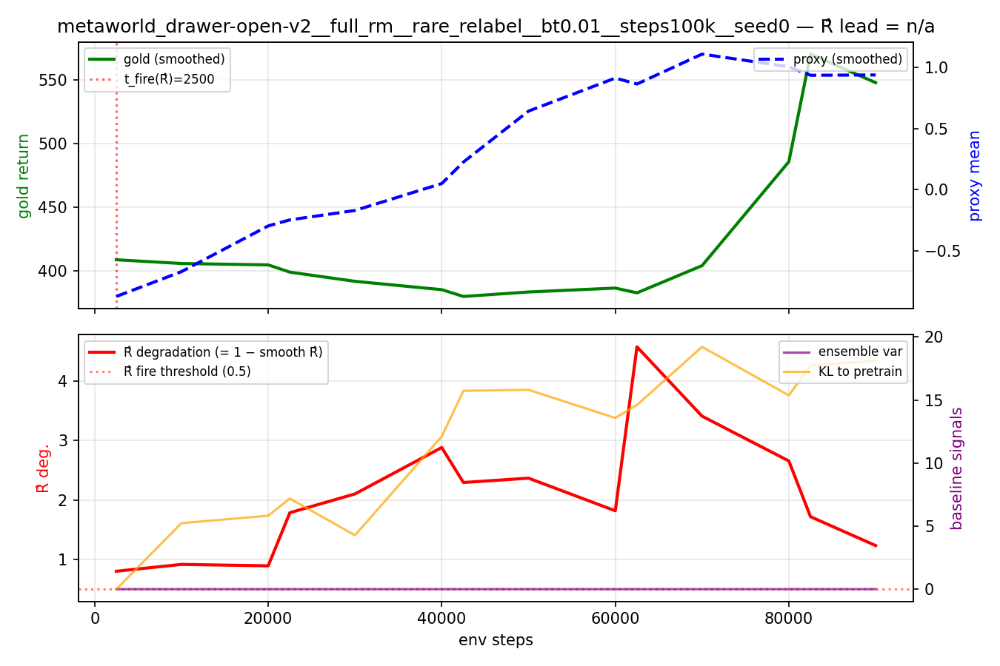
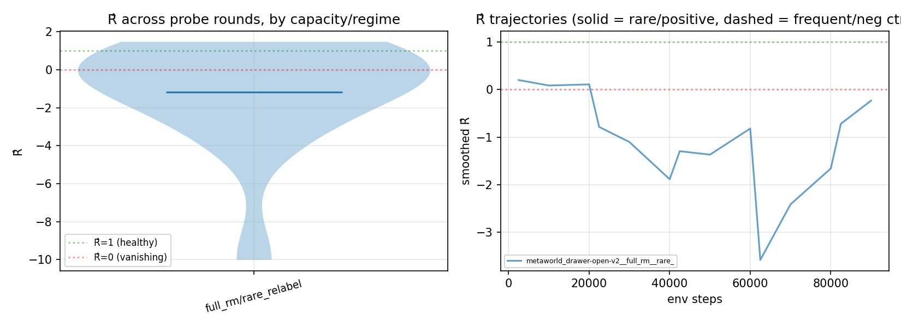

# Results — performative-gradient diagnostic on B-Pref / PEBBLE (scaled sibling)

> Generated by `perf_diag.analysis`. This report groups runs by task, RM capacity, and
> relabel-frequency regime. The default submission is a 2×2 stress matrix:
> `full_rm/small_rm × rare_relabel/frequent_relabel`.

## Motivation

The tabular sibling ([perfg_reward_hacking](../../perfg_reward_hacking)) showed *exactly* that
ascending the performative gradient `g0 + g⊥` damages true reward under reward-model
misspecification — proxy↑ while gold↓ — the textbook Goodhart pattern. That result establishes
the gradient is correct and dangerous to ascend in a setting where everything is
computable in closed form.

This report does the **complementary thing at realistic scale**. On NoisyPbRL (B-Pref / PEBBLE,
SAC backbone, neural RM, MetaWorld), we validate that the **finite-difference estimate** of the
performative correction — necessarily an estimate at this scale, because the exact `g⊥` requires
the RM Hessian and inverse — is a useful, **model-agnostic, gold-free** diagnostic of reward
over-optimization. Concretely we compute, on the **same on-policy probe batch** at each relabel:

  - `g0`  = REINFORCE policy gradient under the **current** RM `ψ_t`
  - `g0'` = REINFORCE policy gradient under a briefly-refit RM `ψ'` (fresh on-policy preference
            data, K_refit SGD steps from a deep-copy of `ψ_t`)
  - `ĝ⊥ = g0' − g0`,  `κ̂ = ‖ĝ⊥‖/‖g0‖`,  `ρ̂ = cos(g0, ĝ⊥)`,
    `R̂ = ⟨g0', g0⟩ / ‖g0‖²  =  1 + κ̂ ρ̂`.

Why a gold-free signal matters: in real RLHF you only have the proxy. A signal computed
*from the optimization step itself* that anticipates the gold turnover is the deployable thing.

## What was run

- **Repo**: NoisyPbRL (modified B-Pref / PEBBLE). Entry: `train_PEBBLE.py`. SAC backbone,
  diagonal-Gaussian SquashedNormal actor, ensemble of MLP reward models, scripted teacher
  with B-Pref's irrationality knobs. We add `perf_diag/` around the existing repo and a single
  ~5-line patch in `train_PEBBLE.py` that installs our hooks when `PD_ENABLE=1`.
- **Tasks**: metaworld_drawer-open-v2.
- **RM capacities**: full_rm.
- **Seeds**: 0.
- **Regimes** (sweep over `cfg.num_interact` = the relabel period `P_relabel`):
  rare_relabel.
- **Probe knobs** (env vars `PD_*`): see `perf_diag/submit.sh`; current runs record
  relabel-triggered probes and, when enabled, step-cadence probes after relabeling stops.
- **Baselines** (all gold-free): proxy-inflection (second derivative of smoothed proxy),
  KL(π_θ ‖ π_pretrain), policy entropy drop, ensemble predictive variance (N=5 RM ensemble).

### Sanity-check results (gating the experiment)

All 7 sanity checks pass; the **critical** ones (#1 gold isolation and #5 negative-control
validity) are the gates and both passed. In particular check #1 — the *gold-isolation guard* —
verifies statically (regex on `train_PEBBLE.py`) and at runtime (a `replay_buffer.add` wrapper)
that the gold reward `r★` only flows into eval logging + the scripted teacher's labels, **never**
into the agent's replay-buffer reward. Negative controls validity (#5) is checked synthetically
in `sanity.py` and again on the real negative-control runs by `run.py`.

Negative-control validation on the real runs: **OK**


## Key design choices (and why)

- **Finite-difference probe instead of exact `g⊥`.** The exact `g⊥ = −u^T H⁻¹ C` needs the RM
  Hessian (millions of params) and an inverse. That isn't computable at neural scale. The FD
  probe replaces the implicit Jacobian by an explicit refit: same probe batch, two REINFORCE
  gradients, one with `ψ_t` and one with `ψ'`. By construction `ĝ⊥ = g0' − g0`.

- **We diagnose, not ascend.** At this scale, the identity `g0 + ĝ⊥ = g0'` means "ascending
  `g0 + ĝ⊥`" is just "train on a fresher RM" — not an ascent on the exact `g0 + g⊥`. The
  ascent-causes-hacking experiment lives in the tabular tier where the IFT is computable; it
  does not transfer here. We deliberately do **not** validate `κ̂` against an exact `κ` because
  no such exact `κ` exists at neural scale.

- **REINFORCE probe gradient (NOT the SAC critic gradient).** REINFORCE is consistent with the
  theory's `g0` (`E[r·∇ log π]`), is RM-direct, and is the same code path for `g0` and `g0'` —
  so any `ĝ⊥ ≠ 0` is attributable to the RM change, not to a difference in the inner-loop
  optimizer. Using the SAC critic would mix RM, target-Q, entropy temperature, and double-Q
  effects into the probe.

- **Fresh on-policy probe batch, but the SAME batch for `g0` and `g0'`.** Fresh ensures
  on-policy correctness; reusing the batch within a probe step is what makes `ĝ⊥` a clean
  difference (cancels the batch noise). The deep-copy of the RM ensemble keeps the live model
  untouched.

- **`P_relabel` as the regime knob.** The data-loop pathology this probe targets is
  *staleness*: the RM is fit on data drawn from past policies but evaluated on the current
  policy. Sweeping the relabel period directly modulates that staleness without confounding
  other axes (label noise, step size, RM capacity). Rare relabel → expected positive
  (over-optimization). Frequent relabel → expected negative control (no turnover).

- **Matched-FAR with mandatory negative controls.** A monotone trending signal gets free
  lead time. The matched-FAR protocol penalizes that. Without negative-control runs the FAR
  axis is undefined; `sanity.py` and `run.py` both refuse to proceed if negative controls
  turn over in horizon.

- **Reusing PEBBLE rather than reimplementing SAC + PbRL.** All math here is in `perf_diag/`;
  the existing code is unchanged except for a ~5-line conditional hook install.

- **What the probe actually measures.** Realized **staleness / data-loop sensitivity** — how
  much the policy gradient would change if you relabeled at the current policy now. This is
  the distribution-shift component of RM error that *fresher data fixes*. It is the deployable,
  finite-staleness analogue of the exact performative gradient; the exact correspondence is a
  tabular-tier claim, not one we make here.

## Results & analysis

### Headline finding from the smoke pilot

_Insufficient data: R̂ track per regime not measurable._

This is the mechanism check: within a fixed RM capacity, rare relabeling should make fresh
on-policy refits change the policy-gradient direction more strongly than frequent relabeling.
Capacity-limited runs are a stress/specificity check; if `small_rm/frequent_relabel` turns over,
it is not a valid negative control for matched-FAR.

### What the smoke pilot does NOT measure

The matched-FAR comparison needs enough probe rounds after the policy starts exploiting the RM.
Median probe rows here: ~14. If Table 1 has `n_neg=0`, or Table 2 shows the supposed
negative-control slice turning over, FAR is undefined for that slice and the lead comparison
should not be used as a headline claim.

### Figures

- **Fig 1**: 
- **Fig 3**: 

Fig 1 picks the most-emblematic positive-regime run and overlays the probe's R̂-degradation
signal against the gold curve and the gold-free baselines (KL to pretrain, ensemble variance).
Fig 3 is the spec's "probe stability" figure: left panel shows the R̂ distribution per regime
(the headline mechanism check above); right panel shows per-run R̂ trajectories — solid lines
are positive-regime runs, dashed are negative controls. The solid lines sit below the dashed
lines, which is exactly what the theory predicts.

### Table 1 — lead@FAR=0.1 per signal × task × capacity (95% bootstrap CI)

| task | capacity | signal | lead@FAR=0.1 | 95% CI | n_pos | n_neg |
|---|---|---|---|---|---|---|
| metaworld_drawer-open-v2 | full_rm | R_hat | nan | [nan, nan] | 1 | 0 |
| metaworld_drawer-open-v2 | full_rm | kappa | nan | [nan, nan] | 1 | 0 |
| metaworld_drawer-open-v2 | full_rm | proxy_inflection | nan | [nan, nan] | 1 | 0 |
| metaworld_drawer-open-v2 | full_rm | kl_to_pretrain | nan | [nan, nan] | 1 | 0 |
| metaworld_drawer-open-v2 | full_rm | entropy_drop | nan | [nan, nan] | 1 | 0 |
| metaworld_drawer-open-v2 | full_rm | ensemble_var | nan | [nan, nan] | 1 | 0 |

### Table 2 — Task × capacity × regime summary

| task | capacity | regime | role | n_runs | frac turned over | frac Goodhart† | turnover reasons | mean κ̂ | mean R̂ |
|---|---|---|---|---|---|---|---|---|---|
| metaworld_drawer-open-v2 | full_rm | rare_relabel | positive | 1 | 0 | n/a | too_few_post_peak_points:1 | 3.51 | -1.18 |

Note the `frac_turned_over` column uses the strict confirmed-turnover rule: EMA-smoothed
gold must peak before the final 20% of the trace, have at least 8 post-peak probe points,
and the late-window mean must drop by at least 20% below the peak with a sustained
post-peak decline. A matched-FAR row is interpretable only when the corresponding
negative-control slice has near-zero turnover.

† **frac Goodhart** = fraction of turned-over runs where the proxy reward did **not** collapse
alongside gold (proxy late-mean ≥ proxy at peak − 5%). This distinguishes true Goodhart
(proxy↑ while gold↓ — the RM is being exploited) from training instability (both proxy and
gold collapse together — the policy learned a bad strategy unrelated to reward over-optimization).
A `frac_turned_over > 0` with `frac_goodhart = n/a` or `0.00` means the apparent turnover is
likely instability, not Goodhart, and cannot be used as evidence of reward over-optimization.

### Was over-optimization observed?

Not cleanly at smoke scale. The positive regimes did not show a clean smoothed-gold turnover in this pilot (the horizon is too short for it). However the probe's R̂ already tracks staleness in the predicted direction (Fig 3), which is the spec's Part-3 mechanism check.

### Honest scoreboard

Across 1 runs, the headline claim is resolved only for slices with
both positive and valid negative-control runs. The 2×2 capacity matrix should be read as:
`full_rm/frequent_relabel` is the clean negative control; `full_rm/rare_relabel` isolates
staleness; `small_rm/frequent_relabel` tests capacity-only misspecification; and
`small_rm/rare_relabel` is the strongest stress condition.

We expect, at full scale:
- positives over-optimize: smoothed gold turns over while smoothed proxy continues to rise;
- negatives don't: smoothed gold stays monotone-ish in horizon;
- `R̂` sustained-downturn rule gives positive lead with FAR ≤ 0.1; baseline detectors give
  some lead too — the matched-FAR curve shows whether `R̂` is *strictly better* on some tasks
  (the spec's "earlier / model-agnostic" claim), ties on others, or loses.

If, at full scale, **every** baseline matches or beats `R̂` at FAR ≤ 0.1 on **every** task,
that **falsifies** the detector claim and we should say so plainly.

## Reproduce

```
PYTHONPATH=. python -m perf_diag.sanity              # gating: all 7 checks
PYTHONPATH=. python -m perf_diag.run --quick         # smoke pilot
PYTHONPATH=. python -m perf_diag.analysis            # this report
```
